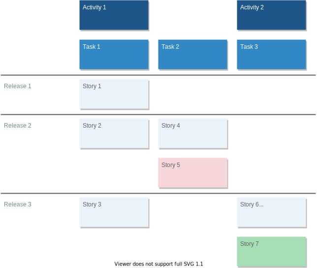

# MarkdownUSM
[](LICENSE)

MarkdownUSM is the best way to draw a beautiful user story mapping diagram from simple markdown file.\
Markdown file will be converted to XML format then you can easily use the diagram on [draw.io](https://app.diagrams.net) and export in another format.



## Installation
```
$ pip install markdownusm
```

## Examples

### Create it

Create a file sample.md with:

```
<!-- Comment -->

<!-- Release titles -->
- Release 1
- Release 2
- Release 3
- Release 4
- Release 5

# Activity 1
## Task 1
Story 1
--- <!-- Release separator -->
Story 2
---
Story 3

## Task 2
---
Story 4

<!-- Suffix `!` changes story postit color for warning -->
Story 5!

# Activity 2
## Task 3
---
---
Story 6 &lt;br&gt; Next line
```

### Run it

The simplest way with:

```
$ musm sample.md

<mxfile>
    <diagram>
        <mxGraphModel dx="661" dy="316" grid="0" gridSize="10" guides="1" tooltips="1" connect="1" arrows="1" fold="1" page="1" pageScale="1" pageWidth="827" pageHeight="1169" math="0" shadow="0" background="#FFFFFF">
        ...
```

Output XML file with:
```
$ musm -o sample.dio sample.md
```

## License
This project is licensed under the terms of the MIT license.
